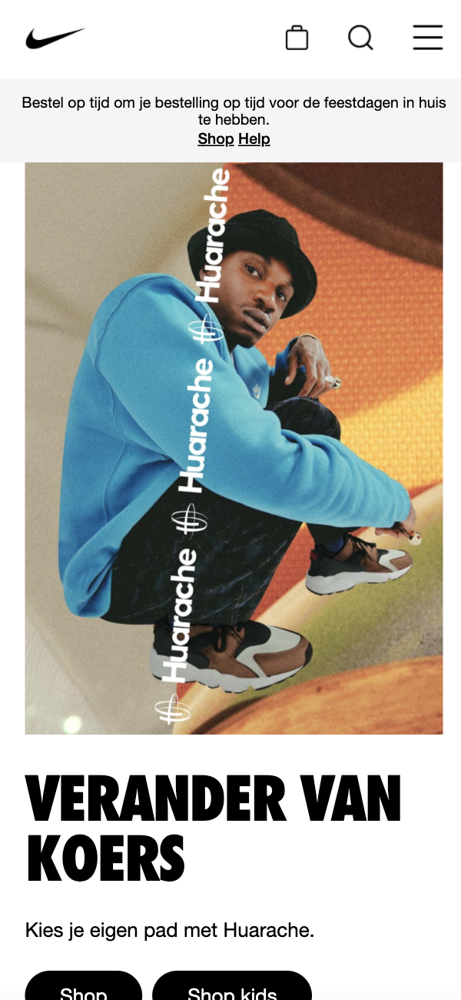
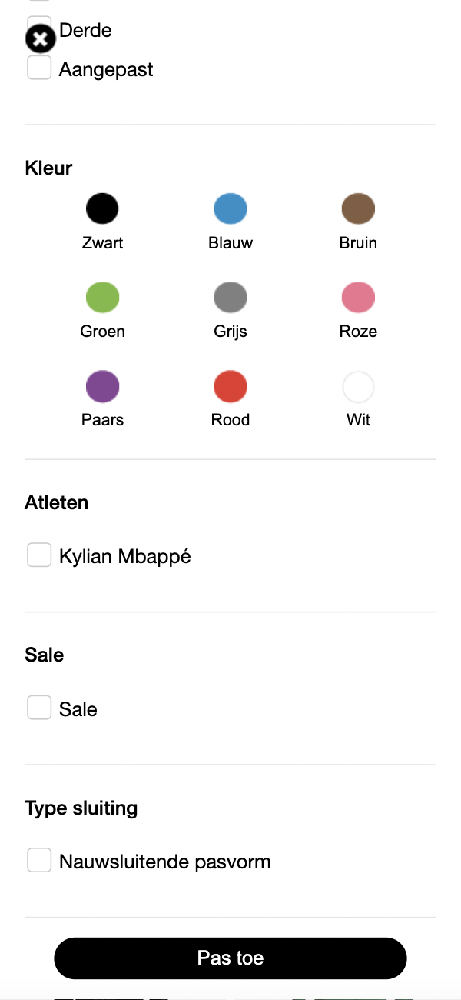

# Procesverslag
Markdown is een simpele manier om HTML te schrijven.  
Markdown cheat cheet: [Hulp bij het schrijven van Markdown](https://github.com/adam-p/markdown-here/wiki/Markdown-Cheatsheet).

Nb. De standaardstructuur en de spartaanse opmaak van de README.md zijn helemaal prima. Het gaat om de inhoud van je procesverslag. Besteedt de tijd voor pracht en praal aan je website.

Nb. Door *open* toe te voegen aan een *details* element kun je deze standaard open zetten. Fijn om dat steeds voor de relevante stuk(ken) te doen.

## Jij

uitwerken voor kick-off werkgroep

### Auteur:
Kasinah Latumanuwy

#### Je startniveau:
rood

#### Je focus:
surface plane
 

## Je website

uitwerken voor kick-off werkgroep

### Je opdracht:
https://www.nike.com/nl/

#### Screenshot(s) van de eerste pagina (small screen): 
Nike homepagina

#### Screenshot(s) van de tweede pagina (small screen):
Paris Saint-Germain (ik ben de mobiele screenshot kwijt dus dit is een screenshot van de webversie)

Hierbij een voorbeeld van een pagina met dezelfde lay-out:

 

## Breakdownschets (week 1)

uitwerken na afloop 2e werkgroep

### de hele pagina: 

## Voortgang 1 (week 2)

uitwerken voor 1e voortgang

Hier was ik niet aanwezig en door familieomstandigheden had ik ook (nog)niet aan mijn website gewerkt.

## Voortgang 2 (week 3)

uitwerken voor 2e voortgang

### Stand van zaken
hier dit ging goed & dit was lastig:

Wat goed ging was het stylen met css van de pagina. Hier was ik begonnen met het eerste deel van mijn html om te kijken of alles werkte.

Ook was het me gelukt om de producten d.m.v. flexbox naast elkaar te zetten. Hier kon ook doorheen gescrold worden.

Waar ik nog moeite mee heb, is het positioneren van content ergens in. Het is de bedoeling dat 'Nike app' en 'Meer info' in de afbeelding komen te staan. Dit lukt mij nog niet zelfstandig.

De footer moet ik nog stylen met css. Hier was ik nog niet klaar mee.

### Verslag van meeting
hier na afloop snel de uitkomsten van de meeting vastleggen

- ik moet gebruik maken van ul ipv a (bijv. in de nav, bij de afbeeldingen van de social media kanalen en in de footer)
- nog beginnen aan de detailpagina
- a href gebruiken ipv buttons (want wordt gestuurd naar andere pagina)
- m.b.v. position content in de image weergeven
- details gebruiken voor uitschuiven content na klikken

## Voortgang 3 (week 4)

uitwerken voor 3e voortgang

### Stand van zaken
hier dit ging goed & dit was lastig:

Nu overal de position goed gedaan.

Via deze sectie kom je op mijn detailpagina.

Hier had ik alleen de content nog in de detailpagina. Het scrollen door de navbar lukte wel. Filter was nog niet uitgewerkt.

### Verslag van meeting
hier na afloop snel de uitkomsten van de meeting vastleggen

- styling lijkt net op de echte website
- headings aanpassen (h1 van kopjes moet h2 zijn en h1 de grote tekst in de eerste sectie)
- moet nog filter uitwerken met javascript
- responsive maken met grid

## Eindgesprek (week 5)

uitwerken voor eindgesprek

### Stand van zaken
Wat goed ging: dingen laten werken met JavaScript (audio, buttons laten luisteren), de dark-mode
Wat minder goed ging: de filter functie van onder naar boven laten schuiven en over de andere content heen zetten. Dit lukte me eerst niet. Toen ging ik op zoek naar voorbeelden en dit heeft mij geholpen.

### Screenshot(s)

## Bronnenlijst

continu bijhouden terwijl je werkt

Nb. Wees specifiek ('css-tricks' als bron is bijv. niet specifiek genoeg).

1. bron 1 muziek: https://www.youtube.com/watch?v=fFlOx8JqAOo
2. bron 2 toggle switch: https://plantpot.works/1162
3. bron 3 niet tonen van scrollbar: https://www.codegrepper.com/code-examples/css/hide+the+overflow-y+scrollbar+css
4. bron 4 odd/even: https://www.w3schools.com/cssref/sel_nth-child.asp
5. bron 5 open filter: https://codepen.io/danielmdesigns/pen/EZreZL
6. bron 6 om radio button en label vertical te alignen: https://stackoverflow.com/questions/13509883/how-to-vertically-align-a-html-radio-button-to-its-label 
7. bron 7 om radio button te stylen: https://usefulangle.com/post/359/custom-radio-button-with-css
8. bron 8 om checkbox te stylen: https://www.youtube.com/watch?v=cXVbsTT5gU8
9. bron 9 animaties: opdracht tijdens de les animaties: https://dlo.mijnhva.nl/content/enforced/324289-FDMCI-2000FED121-DMCI-CMD-2122-1/FED%2021-22%20-%20Blok%202%20-%20Oefening%20animaties.pdf

